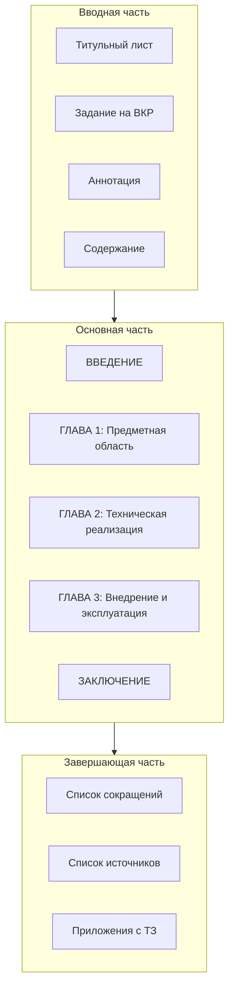
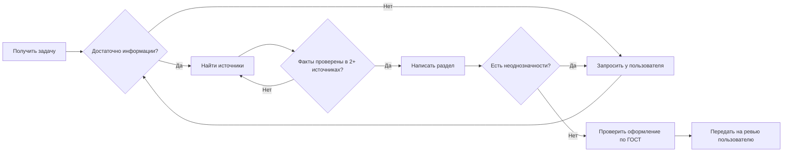

# Roadmap оформления пояснительной записки ВКР

## Метаинформация о проекте

**Тема ВКР:** Разработка программного комплекса на основе мультиагентной архитектуры для автоматизированного управления цифровым присутствием субъектов малого и среднего бизнеса

**Направление:** 09.03.01 «Информатика и вычислительная техника» / 09.03.03 «Системная и программная инженерия»

**Объем работы:** минимум 80 страниц (5 печатных листов) без приложений

---

## Правила для LLM-агентов

### Обязательные правила при работе над разделами:

1. **Фактчекинг информации:**
   - Любая статистика, факты, данные исследований должны проверяться минимум в 2-3 независимых источниках
   - Указывать источники для каждого утверждения в квадратных скобках [n]
   - Приоритет источников: научные статьи (РИНЦ, Scopus, Web of Science) > официальные отчеты > авторитетные СМИ
   - Срок давности источников: не старше 5 лет (для технологий - не старше 3 лет)

2. **Консультация с пользователем ОБЯЗАТЕЛЬНА при:**
   - Выборе конкретных технологий и платформ
   - Определении архитектурных решений
   - Формулировке требований к системе
   - Выборе аналогов для сравнительного анализа
   - Любых неоднозначных или спорных вопросах
   - Отсутствии достоверной информации по теме

3. **Стиль изложения:**
   - Научный стиль, безличные конструкции (3-е лицо мн.ч.)
   - Никаких англицизмов при наличии русских аналогов (backend = серверная часть, frontend = клиентская часть)
   - Все аббревиатуры расшифровываются при первом упоминании
   - Никаких эмоциональных оценок и разговорных оборотов

4. **Форматирование по ГОСТ:**
   - Times New Roman, 14 пт, полуторный интервал
   - Абзацный отступ 1,25 см
   - Поля: верх/низ - 20 мм, лево - 30 мм, право - 15 мм
   - Нумерация страниц внизу по центру (Times New Roman, 12 пт)

---

## Структура пояснительной записки

---

## Фаза 1: Подготовка структуры и вводных материалов

### 1.1 Титульный лист
- Заполнить по шаблону из Приложения В методических указаний
- Указать тему без кавычек
- ФИО студента, руководителя (со степенью/званием)

### 1.2 Задание на ВКР  
- Заполнить по шаблону из Приложения Г
- Включить диаграмму Ганта с этапами работы
- Указать состав документации и графической части

### 1.3 Аннотация (до 600 знаков)
**Содержание:**
- Краткое описание работы, проблема, цель
- Методология (мультиагентный подход, A2A-протокол)
- Краткое содержание глав
- Практические результаты и область применения

---

## Фаза 2: ВВЕДЕНИЕ (3-4 страницы)

**Задача агента:** Написать связный текст введения

### Структура введения:

1. **Актуальность темы** (со ссылками на источники)
   - Статистика о цифровом присутствии МСБ
   - Проблемы ручного управления множественными платформами
   - Тренды RPA и автоматизации

2. **Степень разработанности темы**
   - Обзор существующих решений (SaaS-платформы, SMM-сервисы)
   - Пробел: отсутствие легковесных решений для МСБ на основе МАС

3. **Цель работы**
   > Разработка и внедрение прототипа программного комплекса для автоматизированного управления цифровым присутствием МСБ на основе мультиагентной архитектуры

4. **Задачи работы** (из файла темы - 6 задач)

5. **Объект исследования:** Процессы управления цифровым присутствием МСБ

6. **Предмет исследования:** Методы автоматизации поддержания консистентности бизнес-информации на онлайн-платформах с использованием мультиагентного подхода

7. **Методы исследования**
   - Анализ предметной области
   - Сравнительный анализ аналогов
   - Моделирование (UML, BPMN)
   - Разработка ПО

8. **Научная новизна и практическая значимость**

9. **Структура работы** (краткое описание глав)

---

## Фаза 3: ГЛАВА 1 - Предметная область и технологии (20-25 страниц)

### 1.1 Описание предметной области (5-6 страниц)
**Подзадачи для агента:**
- [ ] Описать проблемы управления цифровым присутствием МСБ
- [ ] Привести статистику использования платформ (Google Maps, Яндекс.Карты, соцсети)
- [ ] Описать типичные бизнес-процессы МСБ по управлению онлайн-присутствием
- [ ] Построить диаграмму AS-IS (текущее состояние)
- [ ] Определить роли пользователей системы (администратор, владелец бизнеса, оператор)

**Спросить пользователя:** Конкретная предметная область (кофейня, салон красоты, автосервис?)

### 1.2 Постановка задачи и требования к системе (4-5 страниц)
**Подзадачи для агента:**
- [ ] Формализовать проблему
- [ ] Сформулировать цель и задачи разработки
- [ ] Описать функциональные требования к системе
- [ ] Описать нефункциональные требования (надежность, производительность)
- [ ] Разработать структуру БД (инфологическая модель)
- [ ] Построить диаграмму TO-BE (целевое состояние)

### 1.3 Обзор современных технологий (4-5 страниц)
**Подзадачи для агента:**
- [ ] Обзор мультиагентных систем (МАС)
- [ ] Обзор протоколов A2A-взаимодействия (FIPA-ACL, MCP)
- [ ] Сравнение языков программирования для агентов (Go vs Python vs Java)
- [ ] Обзор технологий веб-разработки (Next.js, React)
- [ ] Сравнительная таблица с критериями выбора

**Спросить пользователя:** Подтверждение стека технологий (Go для MCP-агентов, Next.js для веб-интерфейса)

### 1.4 Анализ аналогов (4-5 страниц)
**Подзадачи для агента:**
- [ ] Определить критерии оценки аналогов
- [ ] Проанализировать Bitrix24, amoCRM, SendPulse
- [ ] Проанализировать Hootsuite, Buffer, SMMPlanner
- [ ] Проанализировать ORM-системы (Yagla, YouScan)
- [ ] Построить сравнительную таблицу
- [ ] Сформулировать выводы и преимущества разрабатываемой системы

### 1.5 Выводы по главе 1 (0.5 страницы)

---

## Фаза 4: ГЛАВА 2 - Техническая реализация (25-30 страниц)

### 2.1 Проектирование архитектуры системы (6-7 страниц)
**Подзадачи для агента:**
- [ ] Описать общую архитектуру мультиагентной системы
- [ ] Спроектировать агента-оркестратора
- [ ] Спроектировать специализированных агентов (Google Maps, Telegram, Instagram)
- [ ] Описать механизм координации и обмена сообщениями
- [ ] Построить диаграммы: компонентов, последовательности, развертывания (UML)

**Минимум 5 UML-диаграмм**

### 2.2 Проектирование базы данных (4-5 страниц)
**Подзадачи для агента:**
- [ ] Разработать инфологическую модель (ER-диаграмма)
- [ ] Разработать даталогическую модель
- [ ] Описать основные сущности и связи
- [ ] Привести типовые SQL-запросы

**Минимум 10 таблиц в БД, минимум 500 записей**

### 2.3 Проектирование пользовательского интерфейса (4-5 страниц)
**Подзадачи для агента:**
- [ ] Разработать структурную схему интерфейса
- [ ] Описать экранные формы (минимум 20 типов страниц)
- [ ] Обосновать выбор цветового решения и типографики
- [ ] Привести прототипы интерфейса

### 2.4 Техническая реализация (6-7 страниц)
**Подзадачи для агента:**
- [ ] Описать реализацию MCP-агентов на Go
- [ ] Описать реализацию веб-интерфейса на Next.js
- [ ] Описать интеграцию с внешними API
- [ ] Привести листинги ключевого кода (Courier New, 12 пт)
- [ ] Описать используемые библиотеки и зависимости

**Минимум 5000 строк кода, минимум 2 алгоритма**

### 2.5 Инсталляция и настройка (2-3 страницы)
**Подзадачи для агента:**
- [ ] Описать требования к техническим средствам
- [ ] Описать процедуру установки
- [ ] Привести краткую инструкцию пользователя

### 2.6 Выводы по главе 2 (0.5 страницы)

---

## Фаза 5: ГЛАВА 3 - Внедрение и эксплуатация (15-20 страниц)

### 3.1 Тестирование и внедрение (5-6 страниц)
**Подзадачи для агента:**
- [ ] Описать методику тестирования
- [ ] Провести тестирование на примере типового бизнеса
- [ ] Описать результаты тестирования
- [ ] Сравнить прогнозируемые и фактические характеристики

### 3.2 Оценка эффективности (4-5 страниц)
**Подзадачи для агента:**
- [ ] Определить критерии эффективности
- [ ] Провести сравнительный анализ (до/после внедрения)
- [ ] Оценить экономический эффект

### 3.3 Маркетинговая стратегия / Бизнес-план (3-4 страницы)
**Спросить пользователя:** Какой аспект раскрыть - маркетинг, бизнес-план или научная новизна?

### 3.4 Вопросы информационной безопасности (2-3 страницы)
**Подзадачи для агента:**
- [ ] Описать угрозы безопасности
- [ ] Описать меры защиты данных
- [ ] Описать выбор лицензии на ПО

### 3.5 Выводы по главе 3 (0.5 страницы)

---

## Фаза 6: ЗАКЛЮЧЕНИЕ (1 страница)

**Подзадачи для агента:**
- [ ] Подвести итоги по каждой задаче из введения
- [ ] Описать достигнутые результаты
- [ ] Указать практическую ценность
- [ ] Наметить перспективы развития

---

## Фаза 7: Завершающие элементы

### 7.1 Список сокращений и условных обозначений
- Алфавитный порядок
- Формат: МАС - Мультиагентная система

### 7.2 Список использованных источников
**Требования:**
- Минимум 50 источников
- ~5% на иностранном языке (минимум 2-3)
- Не более 50% электронных источников
- Оформление по ГОСТ Р 7.0.100-2018
- Порядок: по мере упоминания в тексте

### 7.3 Приложения
- **Приложение А:** Техническое задание (по ГОСТ 19.201-78 или ГОСТ 34.602-2020)
- **Приложение Б:** Листинги программного кода
- **Приложение В:** Диаграммы и схемы
- **Приложение Г:** Экранные формы интерфейса
- **Приложение Д:** Акт внедрения (при наличии)

---

## Контрольные показатели ВКР (Таблица 2 методических указаний)

| Характеристика | Минимум | Статус |
|----------------|---------|--------|
| Количество платформ | 2 | [ ] |
| Количество языков программирования | 2 | [ ] |
| Объем кода (строк) | 5000 | [ ] |
| Таблиц в БД | 10 | [ ] |
| Записей в БД | 500 | [ ] |
| Ролей пользователей | 3 | [ ] |
| Экранных форм | 20 | [ ] |
| Внешних API | 1 | [ ] |
| Алгоритмов | 5 | [ ] |
| Функций | 30+ | [ ] |

---

## Процесс работы агентов

---

## Последовательность выполнения задач

1. Начать с **Введения** - определяет структуру всей работы
2. Перейти к **Главе 1** - формирует требования и ТЗ
3. Параллельно разрабатывать **ТЗ** (Приложение А)
4. Работать над **Главой 2** после утверждения требований
5. **Глава 3** требует фактических данных о внедрении
6. **Заключение** пишется последним
7. **Аннотация** корректируется после завершения всей работы

---

## Ключевые файлы проекта

- **Методические указания по выполнению:** `docs/Методические_указания_1_ВКР_выполнения_каф_ИКТ_2024_3.docx`
- **Методические указания по оформлению:** `docs/Методические_указания_ОФОРМЛЕНИЯ_ВКР_каф_ИКТ_2024_4.docx`
- **Тема и описание проекта:** `docs/Тема для ВКР.txt`
- **Данный Roadmap:** `docs/VKR_ROADMAP.md`
