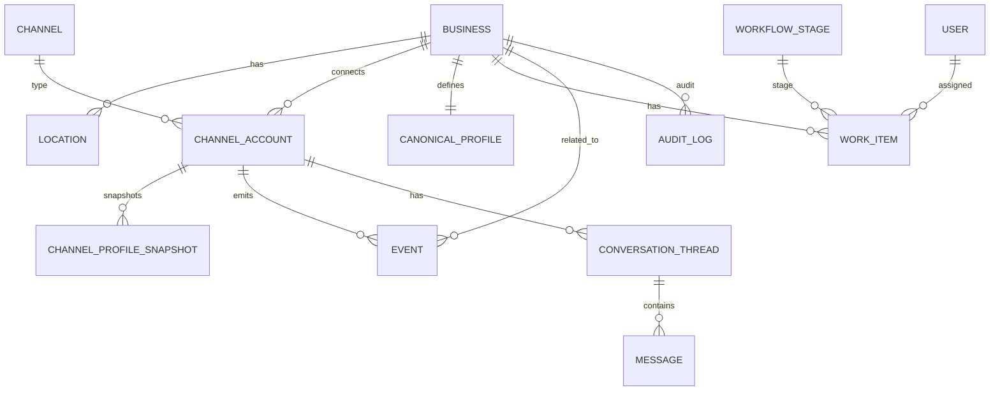

## Пояснительная записка ВКР (черновик)

Основание: `docs/VKR_ROADMAP.md`.

### Аннотация

_TBD_

### Введение

#### Актуальность

Для малого и среднего бизнеса цифровое присутствие (карточки организации, данные в картах/поиске, отзывы, коммуникации в мессенджерах и социальных сетях) становится важным каналом привлечения и удержания клиентов. В российском контексте значимость геосервисов как инструмента выбора офлайн‑заведений подтверждается исследованием РОМИР: 63% жителей страны используют геосервисы для поиска офлайн‑бизнеса, а геосервисы часто применяются для уточнения графика работы (48%); при выборе в онлайн‑картах пользователи дополнительно смотрят на рейтинг (59%) и отзывы (51%) [35]. Это делает качество и актуальность справочной информации (адрес, часы работы, контакты) и репутационного контура (отзывы/рейтинг) критичными для бизнеса.

Международные исследования (на примере США) подтверждают тот же общий тренд: значимая часть аудитории использует онлайн‑поиск и платформы бизнес‑информации при выборе компаний, а также учитывает отзывы при принятии решения [1], [2]. При этом ошибки и несоответствия в справочных данных (адрес, часы работы, контакты) способны приводить к отказу от обращения в компанию у существенной доли потребителей [1], [3]. Документация Google Business Profile подтверждает, что именно эти поля относятся к ключевым атрибутам профиля компании и требуют актуализации владельцем [4].

Дополнительно усложняет ситуацию многоплощадочность: пользователи сопоставляют информацию и отзывы на разных платформах, а также обращаются к нескольким источникам перед выбором бизнеса [5]. В российском сегменте онлайн‑торговли исследования также отмечают влияние полноты информации о товаре/услуге и отзывов на доверие к продавцу [36]. В результате для компании критичными становятся процессы поддержания консистентности справочных данных и своевременной реакции на обратную связь (отзывы/сообщения) в нескольких цифровых каналах [1], [5], [35].

В научной литературе роботизация процессов (Robotic Process Automation, RPA) рассматривается как подход к автоматизации повторяющихся и регламентированных задач в бизнес‑процессах [6], а также отмечается устойчивый рост интереса к тематике и расширение области применения RPA [7]. Это формирует общий контекст актуальности исследований и разработок, направленных на автоматизацию рутинных операций, в том числе в контуре цифровых каналов взаимодействия с клиентами.

#### Цель и задачи работы

**Цель выпускной квалификационной работы** — разработать концепцию и прототип системы OneVoice, предназначенной для управления цифровым присутствием малого и среднего бизнеса на нескольких внешних площадках на основе мультиагентной архитектуры с гибридной моделью интеграции (API + RPA), обеспечивающей платформонезависимость и адаптацию к гетерогенным интеграционным интерфейсам целевых платформ.

Для достижения поставленной цели необходимо решить следующие **задачи**:

- проанализировать предметную область управления цифровым присутствием МСБ, типовые проблемы консистентности данных и доступность API целевых платформ;
- выполнить сравнительный анализ существующих решений (CRM‑системы, SMM‑планировщики, системы мониторинга/ORM) и выявить их ограничения относительно целевого контура автоматизации;
- разработать классификацию целевых платформ по типу интеграции (API / RPA / ручной) и обосновать выбор гибридного подхода;
- выбрать и обосновать технологический подход к построению системы (мультиагентная архитектура, протоколы взаимодействия, API‑интеграции и браузерная автоматизация RPA);
- сформулировать функциональные и нефункциональные требования к системе и предложить структуру данных (БД), поддерживающую ключевые сценарии;
- спроектировать платформонезависимую архитектуру прототипа с единым интерфейсом агента и описать процесс его развёртывания;
- провести сравнительное тестирование API‑агентов и RPA‑агентов на тестовых экземплярах целевых платформ и оценить их технические характеристики (время выполнения, надёжность, устойчивость к изменениям интерфейсов).

#### Объект и предмет исследования

**Объект исследования** — процессы управления цифровым присутствием малого и среднего бизнеса во внешних цифровых каналах (карты/справочники, социальные сети, мессенджеры, отзывы).

**Предмет исследования** — методы и средства автоматизации этих процессов с применением мультиагентных систем и гибридной модели интеграции с внешними платформами (API + RPA).

#### Методы исследования

В работе используются методы анализа предметной области и требований, сравнительный анализ аналогов, проектирование архитектуры информационной системы и базы данных, моделирование потоков данных и процессов, а также прототипирование программного решения.

#### Научная новизна и практическая значимость

**Научная новизна** работы заключается в: (1) разработке платформонезависимой мультиагентной архитектуры с гибридной моделью интеграции (API + RPA), позволяющей единообразно автоматизировать управление цифровым присутствием на платформах с различным уровнем открытости интерфейсов; (2) формализации классификации целевых платформ по типу интеграции и соответствующих шаблонов проектирования агентов; (3) сравнительном анализе технических характеристик API‑агентов и RPA‑агентов (время выполнения, надёжность, устойчивость к изменениям) на тестовых экземплярах целевых платформ.

**Практическая значимость** определяется возможностью применения предложенного прототипа для сокращения трудозатрат на рутинные операции поддержки актуальности данных и обработки обратной связи в нескольких каналах, а также для снижения риска ошибок и несоответствий в бизнес‑информации. Универсальность архитектуры позволяет адаптировать систему к платформам любой страны, заменяя набор агентов без изменения ядра.

#### Структура работы

Пояснительная записка включает введение, три главы, заключение, список источников и приложения. В первой главе рассматриваются предметная область, технологии и аналоги; во второй — проектирование и реализация; в третьей — вопросы внедрения, тестирования и оценки эффективности.

### Глава 1. Предметная область и технологии

#### 1.1 Описание предметной области и проблем управления цифровым присутствием МСБ

#### 1.1.1 Цифровое присутствие локального бизнеса: сущность и состав

Цифровое присутствие локального бизнеса можно определить как совокупность доступных в цифровых каналах данных и сигналов, по которым потенциальный клиент формирует ожидания о компании и принимает решение о взаимодействии. В практическом плане ядро цифрового присутствия составляют «карточки организации» (профили) на платформах бизнес‑информации — сервисах, где отображаются адрес, часы работы, контакты и другие атрибуты компании [4], [3]. В экосистеме крупнейших поисковых платформ такие профили являются ключевыми точками входа: они отображаются в поиске/на картах и служат источником справочной информации для потребителя [1], [4].

#### 1.1.2 Роль базовой бизнес‑информации и проблема актуальности

Для потребителей критичны базовые сведения о компании — прежде всего часы работы и контактно‑адресная информация. В РФ пользователи геосервисов часто используют онлайн‑карты именно для уточнения графика работы (48%) [35], что подчёркивает практическую значимость корректного расписания и контактных данных в карточке организации.

Международные опросные исследования (на примере США) показывают, что существенная доля аудитории отказывается от обращения в компанию при обнаружении некорректных данных онлайн [1], [3]. Это означает, что поддержание актуальности базовых атрибутов профиля (адрес, часы работы, контакты) является регулярной операционной задачей владельца бизнеса [4].

Отдельным фактором риска является рассогласование информации между площадками. По данным исследований, пользователи нередко видят конфликтующие сведения о компании на разных ресурсах [3]. Механизмы редактирования профилей на платформах могут предполагать внесение изменений не только владельцем, но и через предложения правок третьими лицами, что усиливает необходимость контроля и верификации данных [4].

#### 1.1.3 Репутационный контур: отзывы и коммуникации

Помимо справочных данных важной составляющей цифрового присутствия является репутационный контур: отзывы и реакция компании на них. В российском контексте при выборе мест в онлайн‑картах пользователи обращают внимание на рейтинг (59%) и отзывы (51%) [35]. Следовательно, мониторинг отзывов и своевременная реакция на них должны рассматриваться как регулярный процесс, влияющий на доверие и конверсию.

Международные исследования демонстрируют, что ожидание ответа на отзывы распространено среди потребителей и наличие ответов коррелирует с выбором компании [2]. Это дополнительно поддерживает вывод о необходимости системной работы с отзывами [2], [1].

Также в практических сценариях цифрового присутствия присутствуют коммуникации с клиентами в цифровых каналах (сообщения/вопросы), но в рамках данного раздела ключевой акцент делается на двух наиболее проверяемых контурах: (1) консистентность справочных данных и (2) управление отзывами как репутационным сигналом.

#### 1.1.4 Типовой сценарий (пример предметной области)

Для иллюстрации дальнейших разделов в качестве типового примера локального бизнеса далее рассматривается кофейня (решение зафиксировано в `vkr/decisions/decisions.md`). По данным РОМИР, заведения общественного питания — наиболее частая категория поиска в офлайне (84%), а геосервисы используют для уточнения графика работы (48%) [35]. Для кофейни это делает критичными: корректные часы работы (чтобы клиент не пришёл в закрытое время), адрес и маршрут, а также быстрые ответы на вопросы и отзывы (ассортимент, обслуживание, скорость приготовления и т.п.) [35], [2], [4].

#### 1.1.5 Вывод по разделу 1.1

Управление цифровым присутствием МСБ включает регулярное поддержание актуальности справочных данных на платформах бизнес‑информации и управление репутационным контуром через мониторинг и ответы на отзывы. Распределённость каналов и риск рассогласования данных формируют предпосылки к автоматизации процессов контроля, обновления и реакции в рамках единой системы.

#### 1.2 Постановка задачи, требования к системе, структура БД

#### 1.2.1 Формализация проблемы

Исходные материалы ВКР фиксируют задачу автоматизации управления цифровым присутствием МСБ на нескольких внешних площадках (геосервисы — Яндекс.Карты, 2ГИС; социальные сети — VK; мессенджеры — Telegram), включая поддержание актуальности данных и обработку обратной связи [15], [16]. Проблема формализуется следующим образом:

- данные о компании и коммуникации с клиентами распределены по нескольким платформам;
- обновления выполняются вручную или разрозненными инструментами, что повышает риск ошибок и несогласованности;
- отсутствие единого контура контроля и журналирования затрудняет выявление «истины» по бизнес‑данным и управление качеством процессов.

#### 1.2.2 Цель и задачи разработки (в рамках раздела 1.2)

**Цель разработки** в рамках данного раздела — сформулировать требования к системе OneVoice и предложить инфологическую модель данных, достаточную для поддержки ключевых сценариев управления цифровыми каналами [15], [16].

Задачи раздела:

- определить функциональные и нефункциональные требования к системе;
- описать целевое состояние (TO‑BE) процесса управления цифровым присутствием;
- предложить инфологическую модель БД (сущности и связи), обеспечивающую реализацию требований.

Методологически требования следует оформлять в соответствии с практиками инженерии требований и характеристиками «хороших требований» (полнота, однозначность, проверяемость и др.), описанными в стандарте ISO/IEC/IEEE 29148 [8].

#### 1.2.3 Функциональные требования (предварительная версия)

Ниже приведён предварительный перечень функциональных требований (ФТ), составленный по постановке задачи и подлежащий уточнению по результатам консультации с пользователем/заказчиком (требование Roadmap) [15], [16].

- **ФТ‑1. Управление бизнес‑объектами**: создание и ведение карточки бизнеса (организация/филиал/локация), включая базовые атрибуты и метаданные.
- **ФТ‑2. Подключение внешних каналов**: привязка к бизнес‑объекту внешних платформ/каналов (аккаунты/профили) с хранением параметров интеграции и статусов подключений.
- **ФТ‑3. Контроль консистентности данных**: хранение «эталонных» значений бизнес‑атрибутов и их актуальных значений по каналам; обнаружение расхождений и формирование задач на синхронизацию/проверку.
- **ФТ‑4. Оркестрация действий**: постановка и исполнение задач по обновлению данных/контента через специализированных агентов; фиксация результата исполнения и ошибок.
- **ФТ‑5. Контур коммуникаций и обратной связи**: регистрация входящих событий (сообщения/отзывы/комментарии) и привязка к бизнес‑объекту и каналу; поддержка статусов обработки и назначения ответственного.
- **ФТ‑6. Журналирование и трассируемость**: хранение истории изменений (кто/когда/что изменил), статусов задач и ключевых событий по каналам.
- **ФТ‑7. Роли пользователей и доступ**: разграничение прав (например: администратор системы, владелец бизнеса, оператор/контент‑менеджер) с учётом принципа минимально необходимых привилегий.

#### 1.2.4 Нефункциональные требования (рамка качества)

Для структурирования нефункциональных требований (НФТ) целесообразно использовать модель качества ISO/IEC 25010:2023, включающую девять характеристик качества продукта [9]. Описание характеристик и подхарактеристик в явном виде приводится в справочных материалах по ISO/IEC 25010 [10].

Предварительный набор НФТ (в привязке к ISO/IEC 25010):

- **Функциональная пригодность**: система покрывает заявленные сценарии (управление каналами, контроль консистентности, обработка обратной связи).
- **Производительная эффективность**: обработка типовых операций (плановые синхронизации, приём событий, формирование задач) выполняется в приемлемое время при росте числа каналов/сущностей.
- **Совместимость/интероперабельность**: интеграции реализуются через официальные API или браузерную автоматизацию (RPA) и допускают расширение списка платформ; единый интерфейс агента обеспечивает прозрачность метода интеграции для оркестратора.
- **Удобство взаимодействия**: интерфейс поддерживает типовые роли и минимизирует ошибки пользователя при массовых обновлениях.
- **Надёжность**: система сохраняет целостность данных и историю действий при частичных сбоях интеграций.
- **Информационная безопасность**: защищённое хранение токенов/секретов, аудит действий и разграничение доступа.
- **Сопровождаемость**: возможность добавлять новые агенты/коннекторы (как API‑, так и RPA‑агенты) и изменять правила оркестрации без полной переработки системы. Для RPA‑агентов — возможность обновления селекторов без пересборки системы.
- **Переносимость**: возможность развёртывания в целевой инфраструктуре (контейнеризация/типовая установка).

#### 1.2.5 Инфологическая модель БД (концептуальная структура)

Инфологическая модель формируется исходя из необходимости (а) хранить сущности бизнеса и каналов, (б) фиксировать эталонные и фактические данные по каналам, (в) хранить поток событий/коммуникаций и (г) управлять задачами и их статусами [15], [16]. Аналоги CRM‑класса демонстрируют практику консолидации переписок из разных каналов в одной CRM‑сущности (чтобы избежать дублей и иметь целостную историю) [13], [14]. Также распространённым представлением «воронки» является Kanban‑доска со стадиями и карточками, перемещаемыми между стадиями [11], [12].

Предлагаемый набор ключевых сущностей (уровень концепта; детализация полей — в главе 2):

- `business` — бизнес/организация;
- `location` — локация/филиал (если применимо);
- `user` — пользователь системы;
- `role` / `user_role` — роли и назначение ролей;
- `channel` — тип канала/платформы (например: VK, Telegram, Яндекс.Бизнес) и метод интеграции (API / RPA / ручной);
- `channel_account` — подключённый аккаунт/профиль на внешней платформе;
- `canonical_profile` — эталонный профиль (набор «истинных» значений атрибутов);
- `channel_profile_snapshot` — срез фактических атрибутов профиля на конкретном канале (для сравнения/аудита);
- `event` — событие из канала (сообщение/отзыв/упоминание/системное событие);
- `conversation_thread` и `message` — переписка и сообщения (для каналов, где применимо);
- `work_item` — задача/тикет на обработку (синхронизация, ответ, модерация, проверка);
- `work_item_status` / `workflow_stage` — статусы/этапы (в т.ч. для Kanban‑представления) [11], [12];
- `audit_log` — журнал действий и изменений.

Для фиксации связей можно использовать ER‑диаграмму (черновик, уточняется в главе 2):



#### 1.2.6 TO‑BE (целевое состояние процесса)

В целевом состоянии (TO‑BE) управление цифровым присутствием строится как управляемый процесс: пользователь задаёт «эталон» и правила, система фиксирует расхождения и события, далее агенты выполняют автоматизированные действия, а результаты журналируются.

```mermaid
flowchart TD
  A[Эталонные данные бизнеса] --> B[Сбор фактических данных по каналам]
  B --> C{Есть расхождения/события?}
  C -- нет --> D[Периодический мониторинг]
  C -- да --> E[Формирование задач (work items)]
  E --> F[Исполнение задач агентами/интеграциями]
  F --> G[Фиксация результата + аудит]
  G --> H[Обновление статусов/уведомления пользователю]
  H --> D
```

Указанная схема является укрупнённой и служит основанием для дальнейшего проектирования архитектуры (глава 2) и планирования тестирования/оценки эффективности (глава 3).

#### 1.3 Обзор технологий МАС, протоколов A2A, сравнение языков и фреймворков

#### 1.3.1 Мультиагентные системы как технологическая основа

Мультиагентная система (МАС) представляет собой архитектурный подход, при котором решение комплексной задачи достигается за счёт кооперации нескольких специализированных и относительно автономных агентов. Современные обзоры по multi‑agent collaboration подчёркивают распределённость, специализацию и кооперацию как ключевые свойства такого класса систем [17]. Для задачи управления цифровым присутствием МСБ это означает возможность разделить функции между агентами (сбор данных по каналам, проверка, подготовка действий, исполнение через интеграции) при наличии общего механизма координации.

#### 1.3.2 Протоколы взаимодействия: A2A и MCP

Для снижения связности компонентов и повышения расширяемости системы полезно опираться на стандартизированные протоколы обмена сообщениями.

- **A2A (Agent2Agent)**. В спецификации A2A указано, что протокол предназначен для взаимодействия независимых агентных систем и опирается на HTTP, JSON‑RPC 2.0 и Server‑Sent Events (SSE) [18], [19].
- **MCP (Model Context Protocol)**. В спецификации MCP описан стандартный протокол взаимодействия LLM‑хостов/клиентов/серверов с внешними источниками данных и инструментами на базе JSON‑RPC 2.0; при описании реализации важно фиксировать версию/дату спецификации [20], [19].

В рамках OneVoice MCP может рассматриваться как базовый протокол «agent‑to‑tools» (доступ к источникам данных/инструментам), тогда как A2A — как возможный внешний протокол «agent‑to‑agent» при необходимости интероперабельности с внешними агентными системами (решение зависит от выбранной архитектуры и требований).

#### 1.3.3 Интеграции с внешними платформами через API

Поскольку целевые цифровые каналы управляются внешними платформами, принципиальной предпосылкой реализации является наличие официальных API и корректная работа с авторизацией/ограничениями платформ.

Для целевых платформ, актуальных в российском контексте:

- **VK API** предоставляет официальные методы для работы с сообществами, публикациями и комментариями.
- **Telegram Bot API** предоставляет официальное HTTP‑API для ботов [21].
- **Яндекс.Бизнес** и **2ГИС** — лидирующие геосервисы в России (53% и 44% пользователей соответственно, РОМИР, 2025) — **не предоставляют публичного API** для программного управления карточкой организации. Это делает актуальным применение RPA‑подхода (браузерная автоматизация, например Playwright) в качестве альтернативного метода интеграции.

Таким образом, гетерогенность интеграционных интерфейсов целевых платформ (наличие/отсутствие API) является ключевой проблемой, требующей гибридного подхода к проектированию агентов.

> **Примечание.** Instagram (Meta Platforms Inc.\*) исключён из состава целевых платформ: Meta признана экстремистской организацией и запрещена на территории РФ (2022), с 1 сентября 2025 г. действует закон о запрете рекламы на платформах Meta.

#### 1.3.4 Браузерная автоматизация (RPA) как метод интеграции

Для платформ, не предоставляющих публичного API (Яндекс.Бизнес, 2ГИС), применяется подход браузерной автоматизации (Robotic Process Automation, RPA). Суть подхода — программная имитация действий пользователя в веб‑интерфейсе платформы: навигация по страницам, заполнение форм, нажатие кнопок.

Среди инструментов браузерной автоматизации на 2025–2026 гг. выделяются:

| Критерий | Playwright | Selenium | Puppeteer |
|---|---|---|---|
| Поддержка браузеров | Chromium, Firefox, WebKit | Все основные | Только Chromium |
| Язык/среда | Node.js, Python, Go, .NET, Java | Все основные языки | Node.js |
| Автоожидание элементов | Встроено | Требует явных ожиданий | Частично |
| Stealth mode | Через плагины | Через плагины | Через плагины |
| Headless‑режим | Полноценный | Зависит от драйвера | Полноценный |

Для прототипа OneVoice выбран **Playwright** (Go‑биндинг `playwright-go`) как инструмент с наилучшей поддержкой автоожидания элементов, headless‑режима и кроссбраузерного тестирования.

**Ключевые архитектурные решения для RPA‑агентов**:
- единый интерфейс агента (тот же протокол, что и у API‑агентов) — оркестратор не знает, как именно агент взаимодействует с платформой;
- resilient selectors (CSS/XPath с fallback‑стратегией) для устойчивости к изменениям DOM;
- механизм canary check — проверка ключевых элементов страницы перед выполнением операции;
- screenshot‑on‑error для диагностики сбоев;
- human‑like delays (случайные задержки 1–5 с между действиями) для снижения риска детекции.

#### 1.3.5 Предварительный выбор стека и критерии (уточняется с пользователем)

В качестве целевого стека для прототипа подтверждён вариант: Go (агенты/сервер) + Next.js/React (UI) + PostgreSQL (БД) [15], [16].

Для обоснования выбора в рамках ВКР целесообразно использовать таблицу критериев (без утверждений о «единственно верном» выборе):

| Критерий | Go (сервер/агенты) | Python (сервер/агенты) | Java (сервер/агенты) |
|---|---|---|---|
| Производительность и конкурентность | сильная сторона (goroutines) | зависит от реализации/архитектуры | высокая, зрелая экосистема |
| Скорость прототипирования | высокая | очень высокая | средняя |
| Экосистема для API/интеграций | зрелая | очень зрелая | очень зрелая |
| Поддержка/сопровождение | хорошая | хорошая | высокая (корпоративный стандарт) |

| Критерий | Next.js/React (UI) | Альтернативы (обобщённо) |
|---|---|
| Скорость разработки UI | высокая, большая экосистема | зависит от фреймворка |
| SSR/SEO и маршрутизация | поддерживается | зависит от фреймворка |
| Интеграция с API | стандартные подходы | зависит от стека |

Итоговый выбор стека зафиксирован в `vkr/decisions/decisions.md`; конкретные версии технологий могут быть уточнены по мере разработки.

#### 1.4 Сравнительный анализ аналогов

#### 1.4.1 Подход к анализу и критерии сравнения

В рамках главы 1 рассматриваются аналоги, которые частично закрывают контур управления цифровыми каналами МСБ. Перечень аналогов согласован как достаточный для покрытия классов CRM/SMM/ORM и может быть при необходимости скорректирован позднее (см. `vkr/decisions/decisions.md`) [16].

Для сравнения целесообразно использовать критерии:

- **К1. Функциональный охват**: CRM/контакт‑центр; планирование публикаций; мониторинг упоминаний/репутации.
- **К2. Мультиканальность**: количество поддерживаемых каналов и степень «единого окна».
- **К3. Автоматизация**: наличие встроенных сценариев/правил/массовых операций.
- **К4. Управление консистентностью данных**: поддержка «эталона» и контроль расхождений (как отдельная функция).
- **К5. Трассируемость**: журналирование действий и статусов.
- **К6. Расширяемость**: наличие API/интеграций и возможность добавления новых каналов.

#### 1.4.2 Классы аналогов и примеры

**CRM / омниканальные коммуникации.**

- Bitrix24 описывает Contact Center как омниканальный модуль (формы, виджет, live chat, WhatsApp/Telegram, Instagram Direct, телефония, email) [24], [25]. В help‑документации Bitrix24 отдельно описан механизм chat tracker для связывания переписок из разных каналов в одной CRM‑сущности [13].
- SendPulse описывает CRM как систему для управления коммуникациями и продажами в одном интерфейсе, включая коммуникации в мессенджерах «в одном месте» [14]; в базе знаний приводится канбан‑представление воронки сделок [11].
- Kommo (ранее amoCRM) описывает Unified Inbox как единый интерфейс для коммуникаций (включая WhatsApp/Instagram/Telegram) и распределения диалогов между сотрудниками [34].

**SMM‑планирование и публикации.**

- Hootsuite описывает планирование и публикацию контента из одного интерфейса; в справочной документации отмечается сценарий Bulk message upload и ограничение до 350 постов для bulk‑загрузки [26], [27].
- Buffer описывает модуль Publish как инструмент планирования и публикации с подключением нескольких соцсетей и возможностью настраивать посты под платформы; соответствующие операции подтверждаются в help‑центре Buffer [28], [29].
- SMMplanner описывает автоматизированный постинг в соцсети/мессенджеры; отдельно указывается поддержка постинга во VK и Telegram и сценарии планирования [30], [31].

**Мониторинг упоминаний / ORM (social listening).**

- YouScan описывает платформу social listening с визуальным анализом и модулем Visual Insights для распознавания логотипов и анализа изображений [32], [33]. При этом количественные оценки (например, «до 80% больше упоминаний») следует трактовать как заявления вендора [33].

#### 1.4.3 Сравнительная таблица (укрупнённо)

| Класс | Пример | К1: охват | К2: мультиканальность | К3: автоматизация | К4: консистентность данных | К5: трассируемость | К6: расширяемость |
|---|---|---|---|---|---|---|---|
| CRM / контакт‑центр | Bitrix24 [24], [13] | коммуникации/CRM | единое окно коммуникаций | правила/настройки (по данным вендора) | частично (связывание коммуникаций) | частично (CRM‑история) | интеграции/API (по данным вендора) |
| CRM / маркетинг | SendPulse [14], [11] | CRM + коммуникации | единое окно (по данным вендора) | триггеры/воронка | не фокус | есть статусы/воронка | интеграции/API (по данным вендора) |
| CRM / inbox | Kommo [34] | коммуникации + CRM | единый inbox (по данным вендора) | боты/шаблоны (по данным вендора) | не фокус | история диалогов | интеграции (по данным вендора) |
| SMM‑планировщик | Hootsuite [26], [27] | планирование/публикации | несколько платформ | bulk‑планирование | не фокус | история публикаций | интеграции (по данным вендора) |
| SMM‑планировщик | Buffer [28], [29] | планирование/публикации | несколько платформ | очереди/календарь | не фокус | история публикаций | интеграции (по данным вендора) |
| SMM‑планировщик | SMMplanner [30], [31] | планирование/публикации | фокус на VK/Telegram + др. (по данным вендора) | автопостинг/планирование | не фокус | история публикаций | интеграции (по данным вендора) |
| Social listening | YouScan [32], [33] | мониторинг/аналитика | широкое покрытие источников (по данным вендора) | авто‑категории/теги (по данным вендора) | не фокус | отчёты/дашборды | интеграции (по данным вендора) |

#### 1.4.4 Выводы по аналогам и место разрабатываемой системы

Рассмотренные классы решений закрывают отдельные подзадачи: CRM‑системы — коммуникации и воронку, SMM‑планировщики — публикации и календарь контента, social listening — мониторинг упоминаний. Однако постановка OneVoice предполагает интеграцию этих функций в единый процесс управления цифровым присутствием, с поддержанием «эталонных» данных, контролем расхождений между каналами, оркестрацией действий специализированных агентов и сквозным журналированием результатов [15], [16]. Это формирует основу для проектирования интегрирующей мультиагентной системы в последующих главах.

### Глава 2. Техническая реализация

#### 2.1 Проектирование архитектуры МАС

_TBD (см. `tasks/ch2-1/output.md`)_

#### 2.2 Проектирование БД

_TBD (см. `tasks/ch2-2/output.md`)_

#### 2.3 Проектирование UI

_TBD (см. `tasks/ch2-3/output.md`)_

#### 2.4 Техническая реализация

_TBD (см. `tasks/ch2-4/output.md`)_

#### 2.5 Инсталляция и настройка

_TBD (см. `tasks/ch2-5/output.md`)_

### Глава 3. Внедрение и эксплуатация

#### 3.1 Тестирование системы

_TBD (см. `tasks/ch3-1/output.md`)_

#### 3.2 Оценка эффективности внедрения

_TBD (см. `tasks/ch3-2/output.md`)_

#### 3.3 Маркетинговая стратегия / бизнес-план

_TBD (см. `tasks/ch3-3/output.md`)_

#### 3.4 Информационная безопасность и лицензирование

_TBD (см. `tasks/ch3-4/output.md`)_

### Заключение

_TBD (см. `tasks/conclusion/output.md`)_

