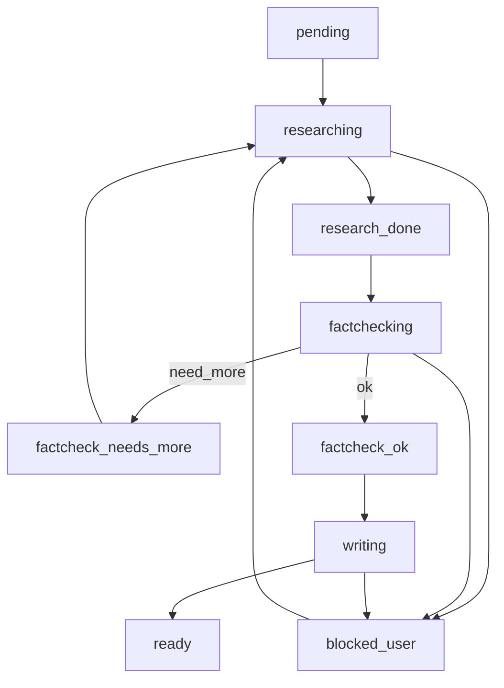

## Orchestration workflow (MainEditor)

Этот документ описывает алгоритм оркестрации работы по “тикетам” в `vkr/tasks/<task_id>/`.

### 1) Статусы и переходы

Файл: `vkr/tasks/<task_id>/status.md`.

Рекомендуемые значения `status`:

- `pending` — тикет создан, работа не начата
- `researching` — идёт сбор материалов (`evidence.md`)
- `research_done` — `evidence.md` готов и передан на проверку
- `factchecking` — идёт фактчекинг (`factcheck.md`)
- `factcheck_needs_more` — нужна доработка `evidence.md` (вернуться к researching)
- `factcheck_ok` — проверка пройдена
- `writing` — MainEditor пишет `output.md`
- `ready` — `output.md` готов, источники учтены, раздел интегрирован в `draft.md`
- `blocked_user` — требуется решение/ответ пользователя (см. `vkr/decisions/open_questions.md`)

Переходы:

### 2) Очередь и параллелизм

Режим 5+5+1:
- До 5 тикетов одновременно могут быть в `researching`.
- До 5 тикетов одновременно могут быть в `factchecking`.
- MainEditor держит максимум 1 тикет в `writing` (чтобы обеспечить единый стиль и корректную нумерацию `[n]`).

### 3) Эскалация вопросов к пользователю

Триггеры (из `docs/VKR_ROADMAP.md`):
- выбор предметной области для 1.1,
- подтверждение стека технологий для 1.3,
- выбор аналогов для 1.4,
- прочие архитектурные/требовательные решения.

Правило:
- фиксируем вопрос в `vkr/decisions/open_questions.md`;
- переводим тикет в `blocked_user`;
- после получения ответа фиксируем решение в `vkr/decisions/decisions.md`;
- снимаем блок, возвращаем в `researching` или `writing` (по ситуации).

### 4) Правило “в output только проверенное”

MainEditor обязан:
- использовать в `output.md` только утверждения со статусом `ok` в `factcheck.md`;
- либо переформулировать утверждение (если `needs_fix`) так, чтобы оно соответствовало подтверждённым границам применимости.

### 5) Нумерация ссылок `[n]` и реестр источников

Файлы:
- `vkr/draft/draft.md` — место “первого появления” ссылок
- `vkr/sources/sources.md` — глобальный реестр

Алгоритм:
1. При написании/интеграции текста MainEditor проверяет: есть ли источник уже в `sources.md`.
2. Если есть — использовать существующий `[n]`.
3. Если нет — добавить источник в конец `sources.md` как следующий номер и использовать новый `[n]`.
4. Не создавать локальные “списки источников” внутри `output.md` — только глобально.

### 6) Сборка `draft.md`

Режим сборки на ранних этапах (MVP):
- В `draft.md` оставить заголовки и вставлять текст из `tasks/<id>/output.md` вручную (копированием содержимого), сохраняя единый стиль и ссылки `[n]`.

Режим “позже” (опционально):
- Автоматизировать сборку скриптом, который конкатенирует `output.md` по порядку `toc.md`, но **только** при стабильной схеме ссылок.

