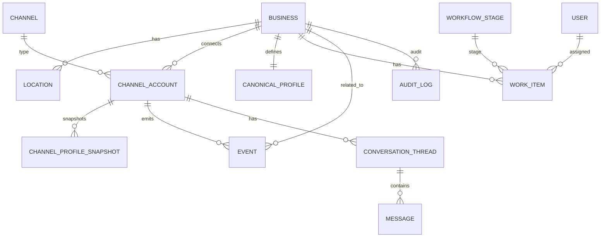

## ch1-2

#### 1.2.1 Формализация проблемы

Исходные материалы ВКР фиксируют задачу автоматизации управления цифровым присутствием МСБ на нескольких внешних площадках (например, Google Business Profile, социальные сети, мессенджеры), включая поддержание актуальности данных и обработку обратной связи [15], [16]. Проблема формализуется следующим образом:

- данные о компании и коммуникации с клиентами распределены по нескольким платформам;
- обновления выполняются вручную или разрозненными инструментами, что повышает риск ошибок и несогласованности;
- отсутствие единого контура контроля и журналирования затрудняет выявление «истины» по бизнес‑данным и управление качеством процессов.

#### 1.2.2 Цель и задачи разработки (в рамках раздела 1.2)

**Цель разработки** в рамках данного раздела — сформулировать требования к системе OneVoice и предложить инфологическую модель данных, достаточную для поддержки ключевых сценариев управления цифровыми каналами [15], [16].

Задачи раздела:

- определить функциональные и нефункциональные требования к системе;
- описать целевое состояние (TO‑BE) процесса управления цифровым присутствием;
- предложить инфологическую модель БД (сущности и связи), обеспечивающую реализацию требований.

Методологически требования следует оформлять в соответствии с практиками инженерии требований и характеристиками «хороших требований» (полнота, однозначность, проверяемость и др.), описанными в стандарте ISO/IEC/IEEE 29148 [8].

#### 1.2.3 Функциональные требования (предварительная версия)

Ниже приведён предварительный перечень функциональных требований (ФТ), составленный по постановке задачи и подлежащий уточнению по результатам консультации с пользователем/заказчиком (требование Roadmap) [15], [16].

- **ФТ‑1. Управление бизнес‑объектами**: создание и ведение карточки бизнеса (организация/филиал/локация), включая базовые атрибуты и метаданные.
- **ФТ‑2. Подключение внешних каналов**: привязка к бизнес‑объекту внешних платформ/каналов (аккаунты/профили) с хранением параметров интеграции и статусов подключений.
- **ФТ‑3. Контроль консистентности данных**: хранение «эталонных» значений бизнес‑атрибутов и их актуальных значений по каналам; обнаружение расхождений и формирование задач на синхронизацию/проверку.
- **ФТ‑4. Оркестрация действий**: постановка и исполнение задач по обновлению данных/контента через специализированных агентов; фиксация результата исполнения и ошибок.
- **ФТ‑5. Контур коммуникаций и обратной связи**: регистрация входящих событий (сообщения/отзывы/комментарии) и привязка к бизнес‑объекту и каналу; поддержка статусов обработки и назначения ответственного.
- **ФТ‑6. Журналирование и трассируемость**: хранение истории изменений (кто/когда/что изменил), статусов задач и ключевых событий по каналам.
- **ФТ‑7. Роли пользователей и доступ**: разграничение прав (например: администратор системы, владелец бизнеса, оператор/контент‑менеджер) с учётом принципа минимально необходимых привилегий.

#### 1.2.4 Нефункциональные требования (рамка качества)

Для структурирования нефункциональных требований (НФТ) целесообразно использовать модель качества ISO/IEC 25010:2023, включающую девять характеристик качества продукта [9]. Описание характеристик и подхарактеристик в явном виде приводится в справочных материалах по ISO/IEC 25010 [10].

Предварительный набор НФТ (в привязке к ISO/IEC 25010):

- **Функциональная пригодность**: система покрывает заявленные сценарии (управление каналами, контроль консистентности, обработка обратной связи).
- **Производительная эффективность**: обработка типовых операций (плановые синхронизации, приём событий, формирование задач) выполняется в приемлемое время при росте числа каналов/сущностей.
- **Совместимость/интероперабельность**: интеграции реализуются через официальные API и допускают расширение списка платформ.
- **Удобство взаимодействия**: интерфейс поддерживает типовые роли и минимизирует ошибки пользователя при массовых обновлениях.
- **Надёжность**: система сохраняет целостность данных и историю действий при частичных сбоях интеграций.
- **Информационная безопасность**: защищённое хранение токенов/секретов, аудит действий и разграничение доступа.
- **Сопровождаемость**: возможность добавлять новые агенты/коннекторы и изменять правила оркестрации без полной переработки системы.
- **Переносимость**: возможность развёртывания в целевой инфраструктуре (контейнеризация/типовая установка).

#### 1.2.5 Инфологическая модель БД (концептуальная структура)

Инфологическая модель формируется исходя из необходимости (а) хранить сущности бизнеса и каналов, (б) фиксировать эталонные и фактические данные по каналам, (в) хранить поток событий/коммуникаций и (г) управлять задачами и их статусами [15], [16]. Аналоги CRM‑класса демонстрируют практику консолидации переписок из разных каналов в одной CRM‑сущности (чтобы избежать дублей и иметь целостную историю) [13], [14]. Также распространённым представлением «воронки» является Kanban‑доска со стадиями и карточками, перемещаемыми между стадиями [11], [12].

Предлагаемый набор ключевых сущностей (уровень концепта; детализация полей — в главе 2):

- `business` — бизнес/организация;
- `location` — локация/филиал (если применимо);
- `user` — пользователь системы;
- `role` / `user_role` — роли и назначение ролей;
- `channel` — тип канала/платформы (например: GBP, Instagram, Telegram);
- `channel_account` — подключённый аккаунт/профиль на внешней платформе;
- `canonical_profile` — эталонный профиль (набор «истинных» значений атрибутов);
- `channel_profile_snapshot` — срез фактических атрибутов профиля на конкретном канале (для сравнения/аудита);
- `event` — событие из канала (сообщение/отзыв/упоминание/системное событие);
- `conversation_thread` и `message` — переписка и сообщения (для каналов, где применимо);
- `work_item` — задача/тикет на обработку (синхронизация, ответ, модерация, проверка);
- `work_item_status` / `workflow_stage` — статусы/этапы (в т.ч. для Kanban‑представления) [11], [12];
- `audit_log` — журнал действий и изменений.

Для фиксации связей можно использовать ER‑диаграмму (черновик, уточняется в главе 2):



#### 1.2.6 TO‑BE (целевое состояние процесса)

В целевом состоянии (TO‑BE) управление цифровым присутствием строится как управляемый процесс: пользователь задаёт «эталон» и правила, система фиксирует расхождения и события, далее агенты выполняют автоматизированные действия, а результаты журналируются.

```mermaid
flowchart TD
  A[Эталонные данные бизнеса] --> B[Сбор фактических данных по каналам]
  B --> C{Есть расхождения/события?}
  C -- нет --> D[Периодический мониторинг]
  C -- да --> E[Формирование задач (work items)]
  E --> F[Исполнение задач агентами/интеграциями]
  F --> G[Фиксация результата + аудит]
  G --> H[Обновление статусов/уведомления пользователю]
  H --> D
```

Указанная схема является укрупнённой и служит основанием для дальнейшего проектирования архитектуры (глава 2) и планирования тестирования/оценки эффективности (глава 3).
